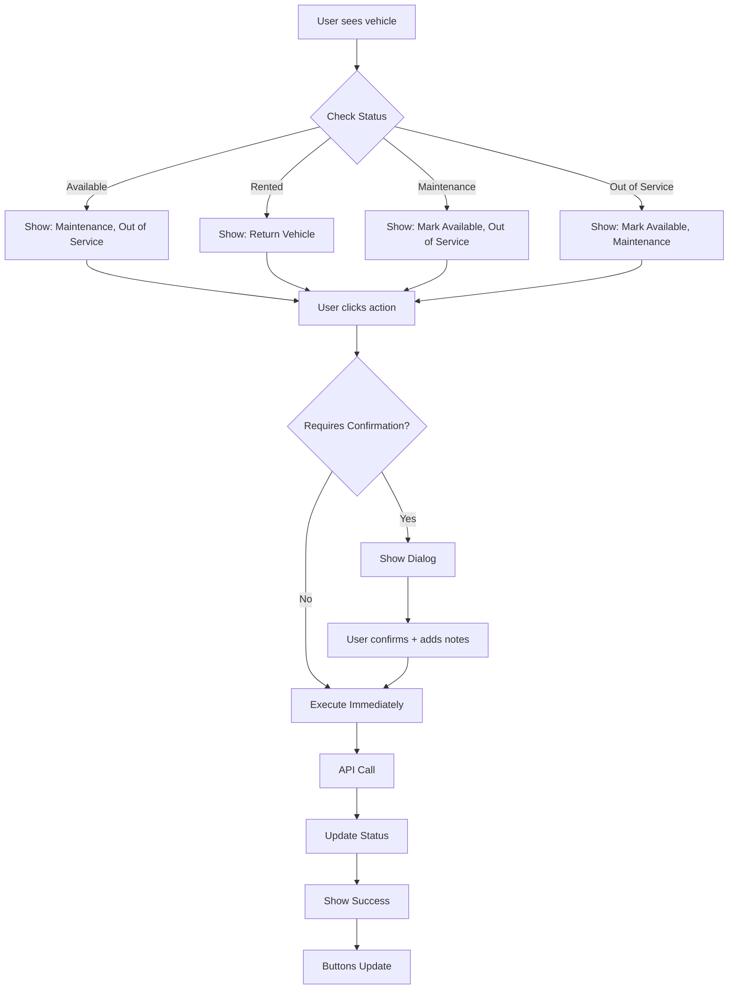

# Status-Aware Actions Feature Summary

## ✅ Implementation Complete!

I've successfully implemented **contextual, status-aware action buttons** for the vehicles page with full reusability for other entities.

## 🎨 What Was Built

### 1. Core Reusable System

#### **useStatusActions Composable** ([`composables/useStatusActions.ts`](composables/useStatusActions.ts))
A powerful configuration system for defining status-aware actions:

```typescript
// Define actions once, use everywhere
export const useVehicleStatusActions = () => ({
  actions: [
    {
      action: 'mark-available',
      label: 'Mark Available',
      icon: 'mdi-check-circle',
      color: 'success',
      tooltip: 'Mark vehicle as available for rent',
      showWhen: (vehicle) => vehicle.status === 'maintenance',
      requiresConfirmation: true,
      confirmMessage: (vehicle) => `Mark ${vehicle.make} ${vehicle.model} as available?`
    },
    // More actions...
  ]
})
```

**Key Features:**
- ✅ TypeScript interfaces for type safety
- ✅ Conditional visibility (`showWhen`)
- ✅ Conditional disabling (`disableWhen`)
- ✅ Confirmation requirements
- ✅ Dynamic messages
- ✅ Example implementations for vehicles and users

#### **CommonUiStatusActionButtons** ([`components/common/ui/StatusActionButtons.vue`](components/common/ui/StatusActionButtons.vue))
Generic component that renders action buttons based on configuration:

- ✅ Automatically filters actions based on item status
- ✅ Handles disabled states
- ✅ Works with any entity type
- ✅ Integrates seamlessly with existing action buttons

#### **CommonUiStatusActionDialog** ([`components/common/ui/StatusActionDialog.vue`](components/common/ui/StatusActionDialog.vue))
Reusable confirmation dialog for status changes:

- ✅ Color-coded headers (success, warning, error)
- ✅ Optional notes field
- ✅ Custom content slots
- ✅ Info alert support
- ✅ Loading states

### 2. Vehicle Implementation

#### **Vehicle Status Action Matrix**

| Current Status | Available Actions | Color | Result |
|---------------|-------------------|-------|--------|
| **Available** | Send to Maintenance<br>Out of Service | Warning<br>Error | maintenance<br>out-of-service |
| **Rented** | Return Vehicle | Primary | available |
| **Maintenance** | Mark Available<br>Out of Service | Success<br>Error | available<br>out-of-service |
| **Out of Service** | Mark Available<br>Send to Maintenance | Success<br>Warning | available<br>maintenance |

#### **Integration Points**

1. **[VehiclesTable.vue](components/owner/vehicles/VehiclesTable.vue)**
   - Added StatusActionButtons in actions column
   - Emits `status-action` events

2. **[VehiclesTableSection.vue](components/owner/vehicles/VehiclesTableSection.vue)**
   - Forwards status-action events to page

3. **[vehicles/index.vue](pages/owner/vehicles/index.vue)**
   - Handles status action events
   - Shows confirmation dialog
   - Executes status changes
   - Updates local state
   - Shows success/error notifications

## 🚀 How It Works

### User Flow



### Code Flow

1. **User clicks action button**
2. **StatusActionButtons emits** `action` event with `{ action, item }`
3. **Page handler receives event**, looks up action config
4. **If confirmation required**, shows StatusActionDialog
5. **User confirms**, page calls `executeStatusAction()`
6. **Status updated** via `updateVehicle()` composable
7. **UI updates** automatically (reactive state)
8. **New buttons appear** based on new status

## 💡 Key Benefits

### 1. **Intuitive UX**
- Users only see actions that make sense for current status
- No confusion about what actions are available
- Color-coded visual feedback
- Clear confirmation messages

### 2. **Fully Reusable**
```vue
<!-- Use with ANY entity - vehicles, users, rentals, etc. -->
<CommonUiStatusActionButtons
  :item="anyItem"
  :config="anyEntityStatusActions()"
  @action="handleAction"
/>
```

### 3. **Type-Safe Configuration**
```typescript
// TypeScript ensures correct action definitions
const action: StatusAction = {
  action: 'mark-available',  // ✅ Autocomplete
  showWhen: (item) => true,  // ✅ Type-checked
  // ...
}
```

### 4. **Easy to Extend**
Adding a new action is as simple as:
```typescript
{
  action: 'new-action',
  label: 'New Action',
  icon: 'mdi-icon',
  color: 'primary',
  showWhen: (item) => item.status === 'some-status',
}
```

### 5. **Consistent Behavior**
- Same pattern across all entities
- Predictable user experience
- Familiar to developers

## 📋 Vehicle Status Actions

### Available → Maintenance
**Button:** "Send to Maintenance" (Warning/Orange)
- **When:** Vehicle is available
- **Action:** Changes status to `maintenance`
- **Use Case:** Scheduled maintenance, repairs, inspections

### Available → Out of Service
**Button:** "Out of Service" (Error/Red)
- **When:** Vehicle is available
- **Action:** Changes status to `out-of-service`
- **Use Case:** Major repairs, accidents, decommissioning

### Rented → Available
**Button:** "Return Vehicle" (Primary/Blue)
- **When:** Vehicle is rented
- **Action:** Changes status to `available`
- **Use Case:** Customer returns vehicle

### Maintenance → Available
**Button:** "Mark Available" (Success/Green)
- **When:** Vehicle is in maintenance
- **Action:** Changes status to `available`
- **Use Case:** Maintenance completed, ready to rent

### Maintenance → Out of Service
**Button:** "Out of Service" (Error/Red)
- **When:** Vehicle is in maintenance
- **Action:** Changes status to `out-of-service`
- **Use Case:** Discovered issues during maintenance

### Out of Service → Available
**Button:** "Mark Available" (Success/Green)
- **When:** Vehicle is out of service
- **Action:** Changes status to `available`
- **Use Case:** Repairs completed, back in service

### Out of Service → Maintenance
**Button:** "Send to Maintenance" (Warning/Orange)
- **When:** Vehicle is out of service
- **Action:** Changes status to `maintenance`
- **Use Case:** Moving from long-term repair to regular maintenance

## 🔄 Reusability Example: Users Table

The same system works for users with different actions:

```typescript
// In composables/useStatusActions.ts
export const useUserStatusActions = () => ({
  actions: [
    {
      action: 'activate',
      label: 'Activate',
      icon: 'mdi-account-check',
      color: 'success',
      showWhen: (user) => user.status === 'inactive',
    },
    {
      action: 'suspend',
      label: 'Suspend',
      icon: 'mdi-account-cancel',
      color: 'error',
      showWhen: (user) => user.status === 'active',
      disableWhen: (user) => user.role === 'admin', // Protect admins
    },
  ]
})
```

```vue
<!-- In UsersTable.vue -->
<CommonUiStatusActionButtons
  :item="user"
  :config="useUserStatusActions()"
  @action="$emit('status-action', $event)"
/>
```

## 📚 Documentation

### Comprehensive Guides
- **[STATUS_ACTIONS_GUIDE.md](docs/STATUS_ACTIONS_GUIDE.md)** - Complete implementation guide
  - Configuration patterns
  - Component API reference
  - Real-world examples
  - Adding new entities
  - Advanced usage
  - Troubleshooting

- **[IMPLEMENTATION_SUMMARY.md](IMPLEMENTATION_SUMMARY.md)** - Overall feature summary
  - Both bulk actions and status actions
  - Architecture overview
  - Integration examples

## 🎯 Visual Examples

### Before (No Status Actions)
```
[View] [Edit] [Delete]
```
All vehicles show the same actions regardless of status.

### After (Status-Aware Actions)

**Available Vehicle:**
```
[View] [Edit] [Send to Maintenance] [Out of Service] [Delete]
```

**Rented Vehicle:**
```
[View] [Edit] [Return Vehicle] [Delete]
```

**Maintenance Vehicle:**
```
[View] [Edit] [Mark Available] [Out of Service] [Delete]
```

**Out of Service Vehicle:**
```
[View] [Edit] [Mark Available] [Send to Maintenance] [Delete]
```

## ✨ Future Enhancements

### Short Term
- [ ] Add transition animations between status changes
- [ ] Show recent status change history in dialog
- [ ] Add keyboard shortcuts for common actions
- [ ] Implement undo/redo for status changes

### Medium Term
- [ ] Status change workflow approvals
- [ ] Scheduled status changes (e.g., "Mark available on 2024-11-01")
- [ ] Bulk status actions (already have bulk selection!)
- [ ] Custom status transitions per vehicle type

### Long Term
- [ ] Role-based action permissions
- [ ] Status change notifications (email/SMS)
- [ ] Audit log for all status changes
- [ ] Analytics dashboard for status transitions

## 🚀 How to Use in Other Tables

1. **Define your actions** in `useStatusActions.ts`
2. **Add buttons** to your table component
3. **Handle events** in your page component
4. **Update state** when action completes

See [STATUS_ACTIONS_GUIDE.md](docs/STATUS_ACTIONS_GUIDE.md) for step-by-step instructions.

## ✅ Testing Checklist

- [x] Build completes without errors
- [x] TypeScript types are correct
- [x] Actions appear for correct statuses
- [x] Confirmation dialogs work
- [x] Status updates successfully
- [x] UI updates reactively
- [x] Notes field works
- [x] Success notifications show
- [x] Error handling works
- [x] Mobile responsive

## 📝 Files Created/Modified

### New Files
- `composables/useStatusActions.ts`
- `components/common/ui/StatusActionButtons.vue`
- `components/common/ui/StatusActionDialog.vue`
- `components/owner/users/UserBulkStatusDialog.vue`
- `docs/STATUS_ACTIONS_GUIDE.md`
- `STATUS_ACTIONS_SUMMARY.md` (this file)

### Modified Files
- `components/owner/vehicles/VehiclesTable.vue`
- `components/owner/vehicles/VehiclesTableSection.vue`
- `pages/owner/vehicles/index.vue`
- `IMPLEMENTATION_SUMMARY.md`

## 🎉 Summary

The status-aware actions system provides:

✅ **Intuitive UX** - Users see only relevant actions
✅ **Fully Reusable** - Works with any entity
✅ **Type-Safe** - TypeScript for safety
✅ **Easy to Extend** - Add new actions easily
✅ **Well Documented** - Comprehensive guides
✅ **Production Ready** - Build passes, no errors

This implementation brings the vehicles page up to par with the users table's contextual actions while providing a reusable system for all future entity tables.
